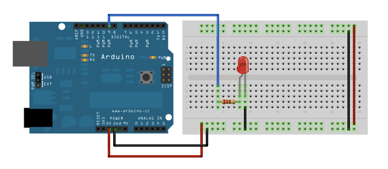

# IDP: Resources

## Platform

In this project, we will be used an [Arduino](https://www.arduino.cc/en/Guide/HomePage) (or OrangePip) as the micro-controller.  The Arduino is a low-cost microcontroller which is programmed in C++ via USB and has digital inputs/outputs, analogue inputs and PWM sockets.  This allows for different sensors/output devices to be controlled.  The mechanical system will be developed using laser cutting, 3D printing and other rapid fabrication methods.

## Hardware

The key components and links to datasheets are given here.  In addition to these there is a store of standard electronic parts.

Microcontroller & Drivers:

* OrangePip ([Arduino](https://store.arduino.cc/arduino-uno-rev3) replica) (x2)
* [Velleman Arduino Motor Driver](https://www.velleman.eu/products/view/?id=412538&country=be&lang=en)
* Prototyping Shield
* Veroboard + Connectors

Sensors/Input Devices

* Compass/Accelerometer
* IR Sensors
* IR Distance Sensor
* Photoresistor
* IR diodes
* Microswitches

Mechanical Components:

* Motors
* Wheels
* Servos
* Wheel Casters
* Bearing Casters

Other:
* Mains to 9V Power Supply (with split ends to power Arduino + Motor Controller)
* USB Lead x 2

A list to all other components available can be found [here](http://www3.eng.cam.ac.uk/DesignOffice/idp/resources/webcat/index.html).

## Electronics: Getting Started

We suggest you take a little bit of time familiarising yourself with the Arduino and reading from sensors and setting outputs.  There is some cross over between this and the software groups, however, 2 Arduino have been provided per team to allow you to both work on this.

The Arduino IDE software is installed on the teaching system, or can be used online, or can be downloaded (for free) on to your personal computer.

First, you need to familiarise yourself with the board and the different pins. Read through [this](https://www.circuito.io/blog/arduino-uno-pinout/) page to understand the different inputs types and how the board works.

**Familiarisation with the Arduino**

* If you are using the web IDE, follow this into [tutorial](https://create.arduino.cc/projecthub/Arduino_Genuino/getting-started-with-arduino-web-editor-on-various-platforms-4b3e4a).
* If you are using th desktop IDE, follow this tutorial.

Make sure you can run the 'blinky LED' script and your LED changes.

**Connect an LED to the Arduino**

Using your breadboard, now wire up an LED to another digital input on your Arduino, as shown in the figure below  You can use jumpers to connect to the Arduino and to the LED; make sure you connect the LED the correct way around and use a current limiting resistor.  Change the program written in the previous task to write to the new digital input with the LED is attached to.


**Read from the Analogue Input**

Connect the LDR on breadboard with another resistor to form a potential divider as shown.  Connect the middle of this potential divider to the analogue Input.


We can now using the following to read from the analog input and then print to the to the serial monitor.  The serial monitor can help for debugging.  Check that the sensor values change when the LDR is covered.

```
int sensorPin = A0;    // select the input pin for the potentiometer

int sensorValue = 0;  // variable to store the value coming from the sensor

void setup() {
  Serial.begin(9600);           //Start serial and set the correct Baud Rate
}

void loop() {
  sensorValue = analogRead(sensorPin);
  Serial.println(sensorValue);
}
```

**Wire-up motor controllers**

Using the [datasheets and documents](https://www.vellemanstore.com/en/velleman-vma03-motor-power-shield-for-arduino-unotm) and examples sketches, wire up the motors.

**Designing your electronics and sensing?**

Things to consider when designing your electronics:
* Do you need a switch/interface to start your robot/reset?
* Talk with mechanics/software, how are you going to mount your sensors?
* Should sensors give you a digital/analogue input? Can you convert to a digital input to reduce the load on the software team?
* How can you connect to the electronics?

Make sure you look at the assessment page to see what is required for Design Acceptance and what must be achieved by when.

**Practical Advice**

* Soldering


## Software: Getting Started

To start with, you should gain familiarity with the Arduino and software and achieve the basics: control of motors, reading from sensors and

**Familiarisation with the Arduino**

**Motor Control**

**Reading from Sensors**

**Interfacing to Python**


Things to consider when developing your software:
* Do you need a switch/interface to start your robot/reset?

## Mechanics: Getting Started

Start designing your chassis.

Advice on CAD for laser cutting: https://www.sculpteo.com/blog/2017/06/14/use-fusion-360-cad-software-for-laser-cutting

**Deparment Rapid Prototyping Facilities**

Information on the rapid prototyping facilities available in the department can be found here:

* [Laser Cutting](https://www.dysoncentre.eng.cam.ac.uk/laser-cutting)
* [3D Printing](https://www.dysoncentre.eng.cam.ac.uk/3d-printing)
* [Plasma Cutter](https://www.dysoncentre.eng.cam.ac.uk/plasma-cutter/cambridge-only/cambridge-only)

The laser cutter may be busy - there are training sessions daily at 12-13 and 14-15; these times should be avoided.  The laser cutter should only not be used out of hours and particular care should be taken when cardboard is cut, as this is easily flammable.


Things to consider when developing your software:
* What pins/how will you be interfacing with the electronics sensors?
* How can you test the software?


## Arduino Software Support


