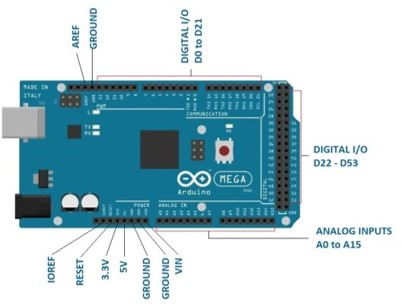
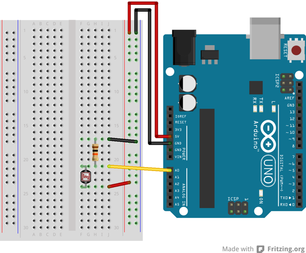

# IDP: Resources

*Note: In this lab we are using OrangePip which are a direct replica of the Arduino and is fully compliant with the Arduino IDE.  More specifically we are using the [Orangepip Mega2560](https://www.orangepipboards.com/) which is a direct equivalent of the Arduino Mega2560, thus any information/tutorials for either of these are relevant.*

## Electronics: Getting Started

We suggest you take a little bit of time familiarising yourself with the microcontroller and reading from sensors and setting outputs. This will enable you to understand how it is possible to interface with sensors using a microcontroller and how the sensor circuitry should be built. There is some cross over between this and the software groups, however, 2 Arduino have been provided per team to allow you to both work on this.

The Arduino IDE software is installed on the teaching system (and can be found on the PCs in the EIETL), or can be used online, or can be downloaded (for free) on to your personal computer.

First, familiarise yourself with the board and the different pins. **Read through [this](https://www.circuito.io/blog/arduino-uno-pinout/) page to understand the different inputs types and how the board works.**  Although this if for an smaller Arduino Uno, the same information holds for the Mega.  The specific pin out for the Arduino is given here:



**Familiarisation with the Arduino**

Follow this [tutorial](https://www.arduino.cc/en/Guide/ArduinoMega2560) to using an programming an Arduino Mega.  If you a using a PC which is running the Arduino IDE for the first time, you may need to install the driver software which can be found [here](https://www.arduino.cc/en/Guide/Windows).  

Make sure you can run the 'blinky LED' script and your LED on your board blinks.

**Connect an LED to the Arduino**

Using your breadboard, now wire up an LED to another digital input on your Arduino, as shown in the figure below.  You can use jumpers to connect to the Arduino and to the LED; make sure you connect the LED the correct way around and use a current limiting resistor (assuming the max forward current of the LED is around 20-30mA).  For more information on how to pick this resistor, read [this page](https://www.build-electronic-circuits.com/current-limiting-resistor/).

Change the program written in the previous task to write to the new digital input with the LED is attached to.  Make the LED turn on/off


**Read from the Analogue Input**

Connect the LDR on breadboard with another resistor to form a potential divider as shown.  Connect the middle of this potential divider to the analogue Input.  To choose the correct resistor, a multi-meter should be used to measure the average resistance of the LDR, and a matched fixed resistor can be used to achieve the largest range of output voltage.  



Build the circuit and check with a multimeter that the voltage in the middle of the LDR circuit changes as expected.

We can now using the following to read from the analog input and then print to the to the serial monitor.  The serial monitor can help for debugging.  Check that the sensor values change when the LDR is covered.

```
int sensorPin = A0;    // select the input pin for the potentiometer

int sensorValue = 0;  // variable to store the value coming from the sensor

void setup() {
  Serial.begin(9600);           //Start serial and set the correct Baud Rate
}

void loop() {
  sensorValue = analogRead(sensorPin);
  Serial.println(sensorValue);
}
```

**Wire-up motor controllers**

Using the [documentation and tutorials](https://learn.adafruit.com/adafruit-motor-shield-v2-for-arduino/overview) and examples sketches for the motor-shield, wire up the motors and check that you can control the direction.

*Passed the wired up motor-shield (with appropiate information) over to your software team.*

**Make a color sensor**

Reflectance can be used to measure the colour of an object nearby.  By shining an LED, and measuring the reflectance of the output using an LDR, the analogue reading can provide an indication of the color as the absorbance of the light will vary with the colour of the material. Using the approaches in the previous tasks (controlling an LED and reading from an LDR) make a colour sensor which uses reflectance.  You may need to adjust the resistor in the potential divider to maximise the sensitivity.

Color filters an be added to the LDR to detect specific colors. A similar approach can be made by using an IR diode + photodetector.  

You could consider using an op-amp to make a comparitor to convert this analogue input into a digital input

**Read from an I2C device**

I2C is a popular method of interfacing with sensors or devices.  This is a digital protocol, which allows multiple devices to be connected over only two data lines making it highly efficient and scale-able.  Information about I2C and how I2C can be interfaced using Arduino is described [here](https://howtomechatronics.com/tutorials/arduino/how-i2c-communication-works-and-how-to-use-it-with-arduino/).

**Understanding the prototyping shield & Vero Board**

To design your can first use breadboard to test, after which you can transfer them over to the prototyping board which is provided and forms a 'shield' above the microcontroller.  Additional circuits can be added by using strip board, which can then be connected by using additional headers.  

This is an excellent [tutorial](https://electronicsclub.info/stripboard.htm) on how to use strip board and how to design circuits when using strip board!  Well worth a read!

**Designing your electronics and sensing: Hints & Tips**

Things to consider when designing your electronics:
* Do you need a switch/interface to start your robot/reset?
* Add indicator LEDs to electronics to identify if the circuits are working without requiring software to  run.
* Talk with mechanics/software, how are you going to mount your sensors and does this influence the design you may require?
* If you want to tune sensititivites (for example potential dividers or inputs to compartors/amplifyers) consider using a variable resistor.
* Should sensors give you a digital/analogue input? Can you convert to a digital input to reduce the load on the software team?
* How can you connect external flying leads/parts attached to the robot to the electronics?

Make sure you look at the assessment page to see what is required for Design Acceptance and what must be achieved by when. This gives some additional advice on how to draw/design circuits.

**Practical Advice**

* Soldering


---


## Software: Getting Started

To start with, you should gain familiarity with the Arduino and software and achieve the basics: writing to Serial, control of motors and reading from sensors.  The following provide details and examples of Arduino programming.  In particular, the first document should be studied in depth and referred to as necessary:

* [Arduino Programming Manual](https://playground.arduino.cc/uploads/Main/arduino_notebook_v1-1.pdf).
* [A cheat sheet of the key C++ commands](https://dlnmh9ip6v2uc.cloudfront.net/learn/materials/8/Arduino_Cheat_Sheet.pdf).

The next exercises provide some introduction to programming using the Arduino:

**Familiarisation with the Arduino**

Follow this [tutorial](https://www.arduino.cc/en/Guide/ArduinoMega2560) to using an programming an Arduino Mega.  If you a using a PC which is running the Arduino IDE for the first time, you may need to install the driver software which can be found [here](https://www.arduino.cc/en/Guide/Windows).  

Make sure you can run the 'blinky LED' script and your LED on your board blinks.

The general structure of Arduino files is as followed:

```
//Any libraries to be included go here
//Any global variables go in here
// Any function prototypes go here

void setup() {
  // Any setup initalisation goes in here
}

void loop(){
  //This is the main part of the program, and this is looped continously until the reset button is pressed.
}

//Any custom functions go here
```

**Writing over Serial**

Used for communication between the Arduino board and a computer or other devices. All Arduino boards have at least one serial port (also known as a UART or USART): Serial. It communicates on digital pins 0 (RX) and 1 (TX) as well as with the computer via USB. Thus, if you use these functions, you cannot also use pins 0 and 1 for digital input or output.  You can use the Arduino environment’s built-in serial monitor to communicate with an Arduino board. Click the serial monitor button in the toolbar and select the same baud rate used in the call to begin().  This is very useful for debugging.  

It is necessary to setup the serial communication in the setup:

```
void setup() {
  Serial.begin(9600);           //Start serial and set the correct Baud Rate
}
```

After this, it is then possible to 'print' data over the serial link in various different manners:

```
Serial.print("Hello World")         //Sends Serial String with no end of line characters
Serial.println("Hello World")         //Sends Serial String with end of line characters
```
It is also possible to perform string handling to print a mix of text and varibles:

```
int sensorValue = analogRead(A0);
String stringOne = "Sensor value: ";
String stringThree = stringOne + sensorValue;
Serial.println(stringThree);
```

Make sure you can print text and variables over the serial. It is also possible to read serial data and perform parsing over the incomming string.  More information on serial handling can be found [here](https://www.arduino.cc/reference/en/language/functions/communication/serial/).


**Digital I/O Ports**

**Read from Analogue Port**

**Servo Control**


**Motor Control**

Once your electrical team are satisfied that they have correctly wired up the motor controller, you can start programming the motor controls. You will need to find out from your electrical/mechanical teams which motor port corresponds to which motor.

Using the [documentation and tutorials](https://learn.adafruit.com/adafruit-motor-shield-v2-for-arduino/overview) you can control the motors.  In particular look at the section at 'DC Motors' and install the relevant libraries.  You can investigate the correct motor speeds to be used.  You could consider writing functions to accelerate/deaccelerate up to a given speed. Develop functions for motor control which may come in useful - for example turning.  Communicate with your mechanical team as how the robot should best turn, what are the intended motor actions for turning?

**Interfacing to Python**

If you would like to do some more complicated progressing on the Arduino, for example where the Arduino is acting as slave device to a computer acting as a master, serial communication between the microcontroller and a PC can be used.  Python can then be used to read/write serial commands, communicating with the Arduino, while allowing more complex processing to be performed offline.

Information about how to interface between an Arduino and a PC using Python can be found here:

* [Provides introduction to interfacing to an Arduino using Python](https://circuitdigest.com/microcontroller-projects/arduino-python-tutorial)
* [Provides some alternative methods of using Python to interface with an Arduino](https://playground.arduino.cc/interfacing/python)

Things to consider when developing your software:

* Do you need a switch/interface to start your robot/reset?

## Mechanics: Getting Started

Start designing your chassis.

Advice on CAD for laser cutting: https://www.sculpteo.com/blog/2017/06/14/use-fusion-360-cad-software-for-laser-cutting

**Department Rapid Prototyping Facilities**

Information on the rapid prototyping facilities available in the department can be found here:

* [Laser Cutting](https://www.dysoncentre.eng.cam.ac.uk/laser-cutting)
* [3D Printing](https://www.dysoncentre.eng.cam.ac.uk/3d-printing)
* [Plasma Cutter](https://www.dysoncentre.eng.cam.ac.uk/plasma-cutter/cambridge-only/cambridge-only)

The laser cutter may be busy - there are training sessions daily at 12-13 and 14-15; these times should be avoided.  The laser cutter should only not be used out of hours and particular care should be taken when cardboard is cut, as this is easily flammable.


Things to consider when developing your software:
* What pins/how will you be interfacing with the electronics sensors?
* How can you test the software?


## Arduino Software Support
